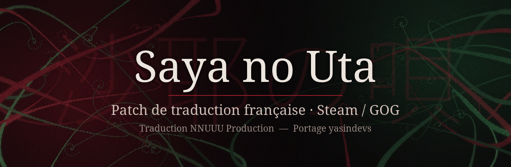

<p align="center">
  
</p>

<p align="center">
  <b>Patch français pour <i>The Song of Saya</i> (version Steam / GOG, moteur Nitroplus N4)</b><br>
  Portage de la traduction de <b>NNUUU Production</b> (2010) vers la réédition moderne du jeu.
</p>

---

## ✨ Ce que fait le patch

- **Tout le scénario en français** : les 36 scripts de l'histoire, les deux choix, les trois fins.
- **Écran « images grotesques »** du menu traduit.
- **Écran de crédits** au lancement du jeu (traduction NNUUU, portage, lien vers ce dépôt).
- **Effets typographiques de la version Steam conservés** : charabia des voix vues par Fuminori,
  casse aléatoire (`"QuE pENses-tU De touT ça ?"`), italiques des pensées.
- **Installation non destructive** : aucun fichier du jeu n'est modifié. Le patch ajoute
  `patch\saya_fr.npk`, que le moteur charge par-dessus `script.npk`.
- **Sauvegardes compatibles** : on peut installer ou retirer le patch en cours de partie.

## 📥 Installation

1. Télécharge **`SayaNoUta-PatchFR.exe`** dans les [Releases](../../releases).
2. Lance-le : le dossier du jeu est détecté automatiquement (GOG ou Steam). Sinon, clique sur **Parcourir…**
   et choisis le dossier qui contient `Saya_en.exe`.
3. Clique sur **Installer le patch**, puis **Lancer le jeu**.

> **Installation manuelle** : copie `saya_fr.npk` dans `<dossier du jeu>\patch\` (crée le dossier `patch`).

**Désinstaller** : bouton **Désinstaller** de l'installateur, ou supprime `patch\saya_fr.npk`.

## ⚠️ Limites connues

- Les **boutons du menu titre et des écrans de configuration** sont des images : ils restent en anglais.
- La traduction NNUUU a été faite à partir de la traduction amateur anglaise de 2009, alors que la
  version Steam utilise la traduction révisée de JAST. Quelques phrases absentes chez NNUUU ont été
  traduites depuis l'anglais pour combler les trous.
- Les noms suivent la romanisation de NNUUU (*Kouji*, *Ryouko*, *Oumi*, *Yousuke*).

## 🐞 Signaler un problème

Le texte a été aligné automatiquement puis relu, mais il peut rester des erreurs : réplique décalée
par rapport à la voix, phrase en anglais, texte qui déborde de la boîte, caractère qui s'affiche en carré…

👉 **[Ouvre une issue](../../issues/new/choose)** en indiquant la scène, la phrase concernée
(une capture d'écran aide beaucoup) et ta version du jeu (Steam ou GOG).

## 🛠️ Reconstruire le patch

Il faut ta copie du jeu (Steam ou GOG) et le fichier `01.utf` de l'ancienne version patchée par NNUUU.

```bash
pip install pycryptodomex pillow
python build.py --game "C:/GOG Games/The Song of Saya" --ons "chemin/vers/01.utf"
# si ton script.npk a déjà été modifié :  --script-npk chemin/vers/script.npk_original
```

Puis l'installateur (optionnel) :

```bash
pip install pyinstaller
python -m PyInstaller --noconfirm --onefile --windowed --name SayaNoUta-PatchFR --icon assets/icon.ico ^
  --add-data "dist/saya_fr.npk;." --add-data "assets/banner_installer.png;." --add-data "assets/icon.ico;." ^
  installer/installer.py
```

### Comment ça marche

| Étape | Outil |
|---|---|
| Lecture / écriture des archives chiffrées NPK2 (AES-256-CBC + deflate) | [`tools/npk2.py`](tools/npk2.py) |
| Lecture des deux formats de script (`.nps` Nitroplus, `01.utf` PONScripter) | [`tools/formats.py`](tools/formats.py) |
| Alignement EN ↔ FR : **identifiants de voix communs** comme ancres, puis alignement par longueur (Gale & Church) entre deux ancres | [`tools/align.py`](tools/align.py) |
| 284 corrections relues à la main (décalages, phrases fusionnées ou découpées, lignes manquantes) | [`data/overrides.json`](data/overrides.json) |
| Génération des `.nps` FR, report du charabia et de la casse aléatoire | [`tools/generate.py`](tools/generate.py) |
| Découpe des pages trop longues pour la boîte de texte (mesure avec Droid Serif 32 px) | [`tools/pagecheck.py`](tools/pagecheck.py) |
| Caractères absents de la police | [`tools/glyphcheck.py`](tools/glyphcheck.py) |
| Relecture des alignements douteux | [`tools/review.py`](tools/review.py), [`tools/ctx.py`](tools/ctx.py) |

Notes de reverse engineering du moteur : [`docs/`](docs/).

## 🙏 Crédits

- **Saya no Uta** © 2003 Nitroplus ― édition anglaise © JAST USA
- Traduction anglaise amateur : TLWiki / tsukuru.info (2008-2009)
- **Traduction française : NNUUU Production (2010)**
  ― traducteur : Ileca · testeurs-correcteurs : Gamera, Jevanni, Jisatsu, Lux · encodage : Eacil
- Portage vers la version Steam / GOG, outils et installateur : **[yasindevs](https://github.com/yasindevs)**,
  avec l'aide de **Claude** (Anthropic) pour l'alignement du texte, les outils et l'installateur

> Traduction publiée avec l'accord de NNUUU Production. Le patch ne contient ni images, ni musiques, ni voix :
> il faut posséder le jeu (Steam ou GOG) pour l'utiliser.
